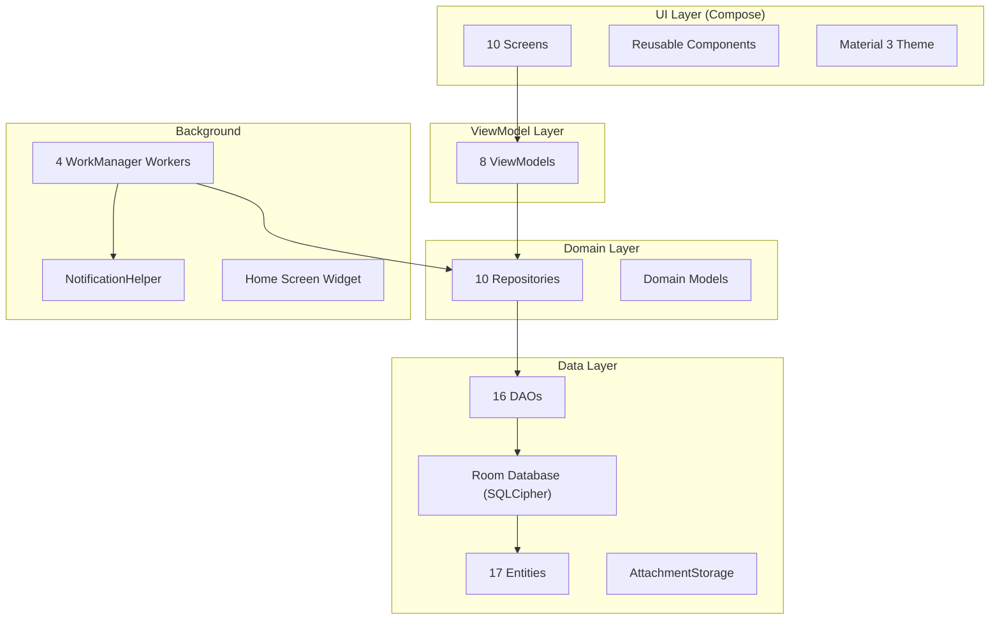

# Expense Manager — Build Walkthrough

## Overview

A fully native **offline-first Android expense manager** built with Kotlin, Jetpack Compose, Room (SQLCipher-encrypted), Hilt DI, and Material 3. Targets **Android 16 (API 36)**, minimum API 26.

---

## Architecture

---

## File Inventory (70+ files)

### Project Config
| File | Purpose |
|------|---------|
| [settings.gradle.kts](file:///c:/Users/ashwi/OneDrive/Desktop/exp%20trial/settings.gradle.kts) | Plugin repos & project structure |
| [build.gradle.kts](file:///c:/Users/ashwi/OneDrive/Desktop/exp%20trial/build.gradle.kts) | Root plugins |
| [app/build.gradle.kts](file:///c:/Users/ashwi/OneDrive/Desktop/exp%20trial/app/build.gradle.kts) | Dependencies, SDK 36, SQLCipher, Coil, Hilt |
| [libs.versions.toml](file:///c:/Users/ashwi/OneDrive/Desktop/exp%20trial/gradle/libs.versions.toml) | Version catalog (20 dependencies) |
| [AndroidManifest.xml](file:///c:/Users/ashwi/OneDrive/Desktop/exp%20trial/app/src/main/AndroidManifest.xml) | Permissions, widget, FileProvider |

---

### Data Layer (17 Entities, 16 DAOs)

| Entity | Key Fields |
|--------|-----------|
| `TransactionEntity` | amount, type, date, category, account, payment method, attachments |
| `CategoryEntity` | name, icon, color, default flag |
| `SubcategoryEntity` | name → parent category (FK) |
| `AccountEntity` | name, type (bank/cash/CC/wallet), initial balance |
| `TagEntity` | name, color |
| `TransactionTagCrossRef` | M:N junction table |
| `BudgetEntity` | amount, period, rollover, alert threshold |
| `GoalEntity` | target amount, current progress |
| `RecurringRuleEntity` | frequency, template fields, next occurrence |
| `ReminderEntity` | title, due date, lead time |
| `LendingEntity` | person, amount, type (lent/borrowed), repaid status |
| `SplitExpenseEntity` | per-person shares of a transaction |
| `QuickAddShortcutEntity` | label, amount, category for one-tap adds |
| `SavedFilterEntity` | serialized filter criteria |
| `CurrencyEntity` | code, symbol, conversion rate |
| `AttachmentEntity` | file path, thumbnail, mime type → transaction (FK) |
| `SettingsEntity` | key-value app config |

**Database**: [AppDatabase.kt](file:///c:/Users/ashwi/OneDrive/Desktop/exp%20trial/app/src/main/java/com/expensemanager/app/data/db/AppDatabase.kt) — SQLCipher-encrypted with default data seeding (12 categories, 3 currencies, default Cash account).

**Security**: [KeystoreHelper.kt](file:///c:/Users/ashwi/OneDrive/Desktop/exp%20trial/app/src/main/java/com/expensemanager/app/security/KeystoreHelper.kt) — Generates 256-bit AES-GCM key in Android Keystore, encrypts a random database passphrase.

---

### UI Screens

| Screen | Key Features |
|--------|-------------|
| **Home** | Balance card, month income/expense, budget progress, quick-add chips, today's spend, recent transactions |
| **Add Transaction** | Calculator-style keypad, category chips, account/date pickers, bill attachment (camera/gallery), bulk mode |
| **Transactions** | Search bar, filter bottom sheet (type/category/date), sort (5 options), swipe-to-delete |
| **Budgets** | Per-category budget progress bars, add dialog with rollover option |
| **Goals** | Progress tracking, transfer-to-goal action, auto-completion |
| **Reports** | Donut chart (category breakdown), line chart (daily trend), bar chart (top categories), budget vs actual |
| **Settings** | Theme toggle (light/dark/system), data management links, export/import options |
| **Accounts** | Account cards with live balance, add account dialog |
| **Categories** | Colored list, add/delete, subcategory management |
| **Lending** | Owed/owe summary cards, settle action, add entry dialog |

---

### Background Workers

| Worker | Schedule | Purpose |
|--------|----------|---------|
| `RecurringTransactionWorker` | Daily | Auto-generates transactions from recurring rules |
| `BudgetCheckWorker` | Every 6 hours | Fires notifications at 80% and 100%+ budget usage |
| `ReminderCheckWorker` | Every 12 hours | Notifies upcoming bill payments (7-day lookahead) |
| `WeeklySummaryWorker` | Weekly | Sends spending summary notification |

---

### Export/Import

| Feature | Implementation |
|---------|---------------|
| CSV Export | SAF-based, proper CSV escaping |
| PDF Export | A4 PdfDocument with header, summary, and transaction table |
| CSV Import | Fuzzy column detection (handles bank statement variations), multi-format date parsing |
| Full Backup | JSON serialization of all tables |

---

## How to Build

1. **Open in Android Studio** (Ladybug or later)
2. Android Studio will auto-download the Gradle wrapper
3. Sync project with Gradle files
4. Build → Run on device/emulator (API 26+)

> [!NOTE]
> The project uses **compileSdk 36** for Android 16. Make sure your Android Studio SDK Manager has API 36 installed.
